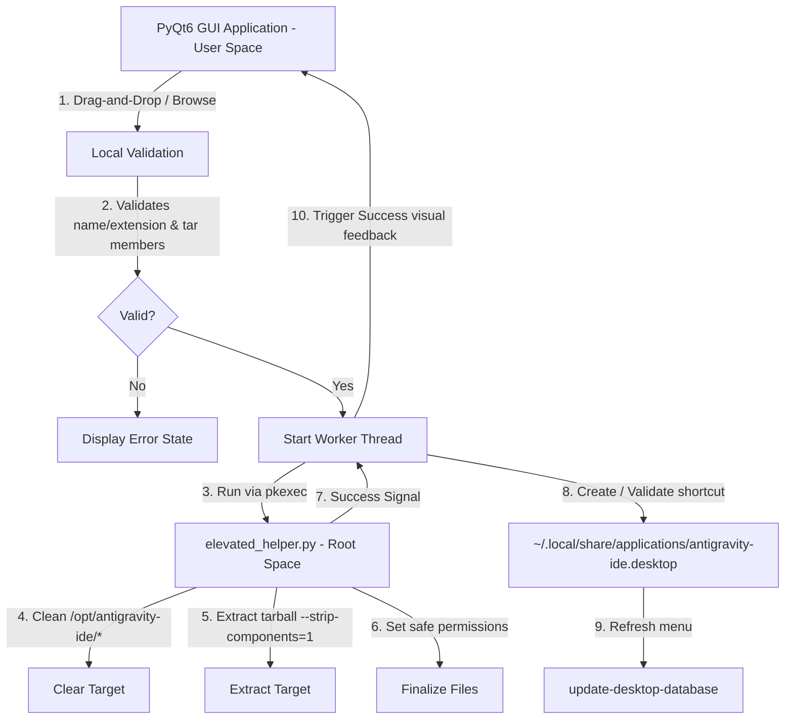

# Antigravity IDE Updater Dropzone

A lightweight Python-based graphical dropzone application using PyQt6 designed for Fedora KDE environments. It allows you to drag-and-drop or select an Antigravity IDE `.tar.gz` archive, validates its structure, elevates via Polkit to securely update `/opt/antigravity-ide`, configures the local `.desktop` entry with the mandatory `--no-sandbox` flag, and refreshes the desktop database.

## Architecture & Security Boundary



By dividing the application into user-space operations (GUI, local validation, and desktop database updates) and root-space operations (directory clearing and extraction under `/opt`), the tool ensures:
- **Zero user-home pollution**: The `.desktop` file is generated and validated under user-space (using the user's home directory), avoiding ownership conflicts where root owns files in the user's `~/.local`.
- **Minimal Root Privilege time**: Root execution is limited to clearing `/opt/antigravity-ide/*` and running `tar` extraction.
- **Single Authentication Prompt**: All root commands are bundled inside `elevated_helper.py`, meaning the user only authenticates via Polkit once.

---

## Features

- **Frameless Glassmorphic Design**: Deep slate semi-transparent gradient layout, with rounded corners and window glow shadows.
- **Draggable Anywhere**: Click and drag anywhere on the window (including the central dropzone area) to position the widget anywhere on your desktop.
- **Full Drag-and-Drop Support**: Hover highlights with green dashed borders and interactive state changes.
- **File Dialog Fallback**: Click anywhere on the central dropzone to select the `.tar.gz` manually if drag-and-drop is inconvenient.
- **Interactive State Machine**:
  - **Idle**: Standard dark state awaiting files.
  - **Drag Over**: Green dashed glow indicating file is ready.
  - **Updating**: Pulsing blue breathing glow and an indeterminate progress bar.
  - **Success**: Emerald green glow with checkmark. Reverts to idle after 5 seconds.
  - **Error**: Coral red glow with custom error messages. Reverts to idle after 6 seconds.

---

## Files

- [main.py](main.py): The main PyQt6 GUI application, state machine, desktop shortcut validation, and background thread manager.
- [elevated_helper.py](elevated_helper.py): The elevated script run via `pkexec` to securely wipe and extract files under `/opt/antigravity-ide`.
- [test_updater.py](test_updater.py): Unittest suite executing verification logic, mock environments, and headless Qt rendering.
- [run.sh](run.sh): A shell utility wrapper to run the application.

---

## Installation & Running

### Option A: Standalone AppImage (Recommended)

You can download the pre-compiled, standalone **AppImage** from the **Releases** tab on GitHub.

Once downloaded, make it executable and run it:
```bash
chmod +x Antigravity_IDE_Updater-x86_64.AppImage
./Antigravity_IDE_Updater-x86_64.AppImage
```

---

### Option B: Running from Source

#### 1. Requirements
Ensure PyQt6 is installed on your Fedora KDE system:
```bash
sudo dnf install python3-pyqt6
```

#### 2. Running the App
Start the app by running:
```bash
./run.sh
```

#### 3. Testing
To run the headless test suite:
```bash
python3 -m unittest test_updater.py
```

